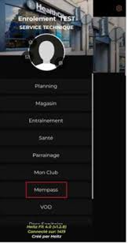

# heitzfit4 integration for Home Assistant

## Installation

### Using HACS

OR

If you can't find the integration, add this repository to HACS, then:  
HACS > Integrations > **heitzfit4**

### Manual install

Copy the `heitzfit4` folder from latest release to the `custom_components` folder in your `config` folder.

## Configuration

Click on the following button:  
  

Or go to :  
Settings > Devices & Sevices > Integrations > Add Integration, and search for "heitzfit4"

You can choose between two options when adding a config entry.  

### using username and password

Use your heitzfit4 URL with username, password and ENT (optional):  

## Usage

This integration provides several sensors, always prefixed with `heitzfit4_LASTNAME_FIRSTNAME` (where `LASTNAME` and `FIRSTNAME` are replaced), for example `sensor.heitzfit4_LASTNAME_FIRSTNAME_timetable_today`.

| Sensor | Description |
|--------|-------------|
| `sensor.heitzfit4_LASTNAME_FIRSTNAME` | basic informations about your child |
| `[...]_timetable_today` | today's timetable |
| `[...]_timetable_tomorrow` | tomorrow's timetable |
| `[...]_timetable_next_day` | next school day timetable |
| `[...]_timetable_period` | timetable for next 15 days |
| `[...]_timetable_ical_url` | iCal URL for the timetable (if available) |
| `[...]_reservation` | reservation |
| `[...]_reservation_period` | reservation for max 6 days |

The sensors are updated every 15 minutes.

## Cards

Cards are available here: https://github.com/delphiki/lovelace-heitzfit4
