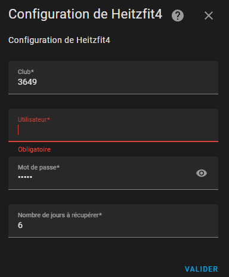

# heitzfit4 integration for Home Assistant

## Installation

### Using HACS

[](https://my.home-assistant.io/redirect/hacs_repository/?owner=mrjulien44s&repository=hacs-heitzfit4&category=integration)

OR

If you can't find the integration, add this repository to HACS, then:  
HACS > Integrations > **heitzfit4**

### Manual install

Copy the `heitzfit4` folder from latest release to the `custom_components` folder in your `config` folder.

## Configuration

Click on the following button:  
[](https://my.home-assistant.io/redirect/brand/?brand=heitzfit4)  

Or go to :  
Settings > Devices & Sevices > Integrations > Add Integration, and search for "heitzfit4"

You can choose between two options when adding a config entry.  

### using username and password

Use your heitzfit4 with username, password and Club Id:  


## Usage


| Sensor | Description |
|--------|-------------|
| `sensor.heitzfit4_planning` | Planning for coming days |


The sensors are updated every 120 minutes.

## Cards

Use a markdown card for now

Sample for planning

```
 
  <h2><ha-icon icon="mdi:calendar-today"></ha-icon> {{as_timestamp(day) | timestamp_custom('%d %b') + ' (' + as_timestamp(day) | timestamp_custom('%A') + ')'}}</h2>
  
    
    
    
      
    
      <ha-alert title="{{as_timestamp(activities.start) | timestamp_custom('%R') + '&nbsp;&nbsp;' + activities.activity + '&nbsp;&nbsp;(' + places + ')'}}" alert-type="{{booking}}">{{'&nbsp;&nbsp;&nbsp;@&nbsp;' + activities.room}}</ha-alert>
  

```


Sample for booking

```
 
  <h2><ha-icon icon="mdi:calendar-today"></ha-icon> {{as_timestamp(day) | timestamp_custom('%d %b')}}{{' (' + as_timestamp(day) | timestamp_custom('%A') + ')'}}</h2>
  
    
    
    
      
      <ha-alert title="{{as_timestamp(activities.start) | timestamp_custom('%R') + '&nbsp;&nbsp;' + activities.activity + '&nbsp;&nbsp;(' + places + ')'}}" alert-type="{{booking}}">{{'&nbsp;&nbsp;&nbsp;@&nbsp;' + activities.room}}</ha-alert>
    
  

```

